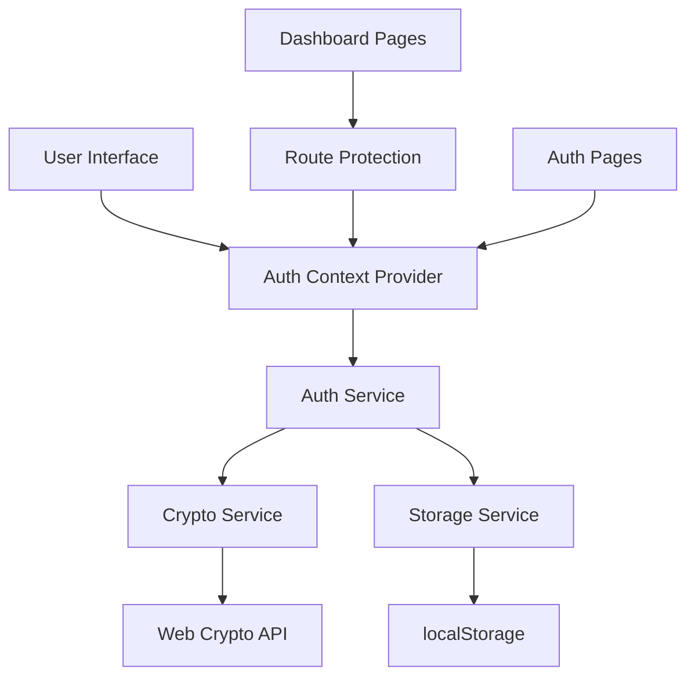

# Design Document

## Overview

The hash-based authentication system will be implemented as a client-side solution using React Context for state management, browser localStorage for persistence, and the Web Crypto API for secure password hashing. The design leverages Next.js App Router with route groups to separate authenticated and unauthenticated flows.

## Architecture

### High-Level Architecture



### Component Hierarchy

- **AuthProvider**: React Context provider managing authentication state
- **AuthService**: Core authentication logic and user management
- **CryptoService**: Password hashing and session token generation
- **StorageService**: localStorage abstraction for user data persistence
- **RouteGuard**: Higher-order component for protecting routes
- **AuthPages**: Sign-in and sign-up form components

## Components and Interfaces

### AuthContext Interface

```typescript
interface AuthContextType {
  user: User | null;
  isLoading: boolean;
  signIn: (email: string, password: string) => Promise<void>;
  signUp: (email: string, password: string) => Promise<void>;
  signOut: () => void;
  isAuthenticated: boolean;
}

interface User {
  email: string;
  sessionToken: string;
  createdAt: string;
}
```

### AuthService Interface

```typescript
interface AuthService {
  signUp(email: string, password: string): Promise<User>;
  signIn(email: string, password: string): Promise<User>;
  signOut(): void;
  getCurrentUser(): User | null;
  isValidSession(sessionToken: string): boolean;
}
```

### CryptoService Interface

```typescript
interface CryptoService {
  hashPassword(password: string): Promise<string>;
  generateSessionToken(): string;
  comparePasswords(password: string, hashedPassword: string): Promise<boolean>;
}
```

### StorageService Interface

```typescript
interface StorageService {
  storeUser(email: string, hashedPassword: string): void;
  getUser(email: string): StoredUser | null;
  storeSession(user: User): void;
  getSession(): User | null;
  clearSession(): void;
  userExists(email: string): boolean;
}

interface StoredUser {
  email: string;
  hashedPassword: string;
  createdAt: string;
}
```

## Data Models

### User Storage Schema

```typescript
// localStorage key: 'auth_users'
interface UsersStorage {
  [email: string]: {
    hashedPassword: string;
    createdAt: string;
  };
}

// localStorage key: 'auth_session'
interface SessionStorage {
  email: string;
  sessionToken: string;
  createdAt: string;
  expiresAt: string;
}
```

### Password Hashing Strategy

- Use Web Crypto API's `crypto.subtle.digest()` with SHA-256
- Add salt using user's email to prevent rainbow table attacks
- Implement PBKDF2 with 100,000 iterations for additional security
- Store salt and iterations count with hashed password

## Error Handling

### Authentication Errors

```typescript
enum AuthErrorType {
  INVALID_CREDENTIALS = 'INVALID_CREDENTIALS',
  EMAIL_EXISTS = 'EMAIL_EXISTS',
  PASSWORDS_DONT_MATCH = 'PASSWORDS_DONT_MATCH',
  INVALID_EMAIL = 'INVALID_EMAIL',
  WEAK_PASSWORD = 'WEAK_PASSWORD',
  STORAGE_ERROR = 'STORAGE_ERROR'
}

class AuthError extends Error {
  constructor(public type: AuthErrorType, message: string) {
    super(message);
  }
}
```

### Error Handling Strategy

- Use toast notifications for user-facing errors
- Log detailed errors to console for debugging
- Graceful fallbacks for localStorage unavailability
- Clear error states on successful operations

## Testing Strategy

### Unit Tests

- **CryptoService**: Test password hashing, salt generation, and comparison
- **StorageService**: Test localStorage operations and data serialization
- **AuthService**: Test authentication flows and error conditions
- **AuthContext**: Test state management and provider functionality

### Integration Tests

- **Sign-up Flow**: Complete user registration process
- **Sign-in Flow**: Authentication with valid/invalid credentials
- **Route Protection**: Access control for protected pages
- **Session Persistence**: Browser refresh and tab navigation

### Component Tests

- **SignUpPage**: Form validation and submission
- **SignInPage**: Login form behavior and error display
- **RouteGuard**: Redirect behavior for authenticated/unauthenticated users

## Security Considerations

### Client-Side Security Measures

1. **Password Hashing**: Use PBKDF2 with high iteration count
2. **Session Tokens**: Cryptographically secure random generation
3. **Input Validation**: Email format and password strength requirements
4. **XSS Protection**: Sanitize all user inputs
5. **Session Expiration**: Implement reasonable session timeouts

### Limitations Acknowledgment

- Client-side authentication is inherently less secure than server-side
- localStorage data can be accessed by malicious scripts
- No protection against determined attackers with browser access
- Suitable for demo/prototype applications, not production systems

## Implementation Phases

### Phase 1: Core Services
- Implement CryptoService with Web Crypto API
- Create StorageService for localStorage operations
- Build AuthService with basic authentication logic

### Phase 2: React Integration
- Create AuthContext and Provider
- Implement authentication state management
- Add error handling and loading states

### Phase 3: UI Components
- Update existing sign-in page with functionality
- Create sign-up page component
- Add form validation and error display

### Phase 4: Route Protection
- Implement RouteGuard component
- Add authentication checks to dashboard layout
- Handle redirects for authenticated/unauthenticated users

### Phase 5: Testing & Polish
- Add comprehensive test coverage
- Implement session expiration
- Add password strength validation
- Polish user experience and error messages